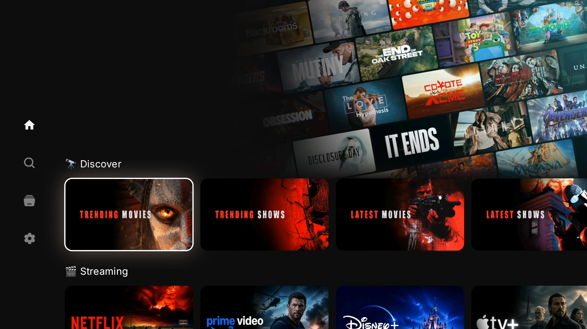
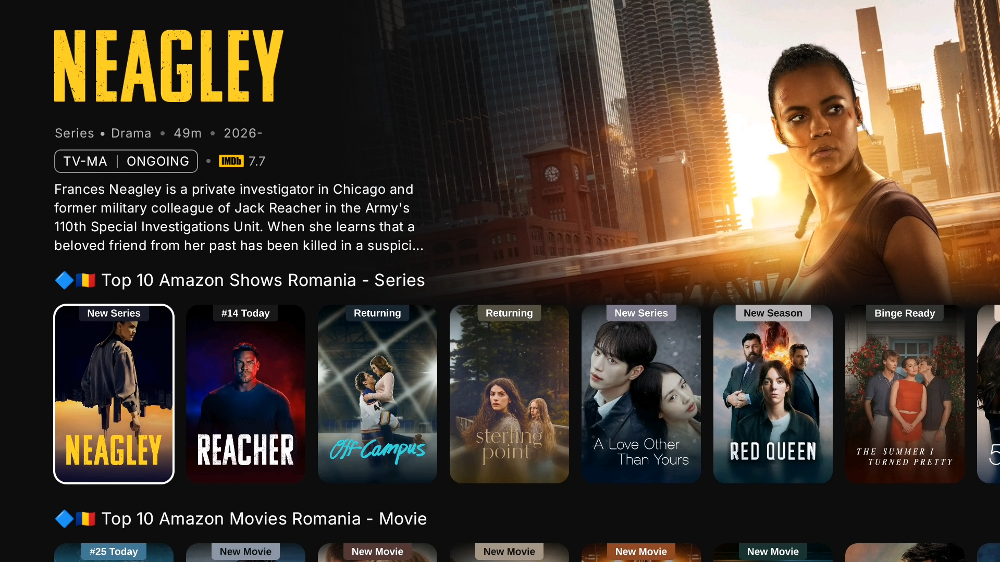
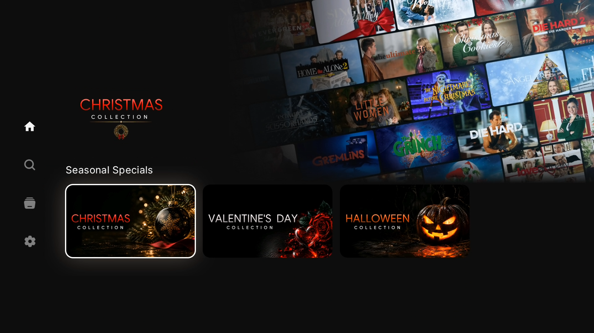

# Nuvio Art

Image assets for the Nuvio collection setup (`catalogs.json`), plus the
automation that regenerates **dynamic backdrops** from your MDBList/TMDB
catalogs every month.

## Setup wizard

A one-page wizard that generates your AIOMetadata + AIOStreams configs and the
collections pack with your API keys pre-filled, then walks you through install:

**https://vladskz.github.io/nuvio-art/**

(Static page under `docs/`, served via GitHub Pages.)

## Demo

A quick look at the finished setup — [watch the video](https://streamable.com/xyjbik)
or open the full [presentation page](https://vladskz.github.io/nuvio-art/demo.html).





## Structure

```
collections/
├── scripts/                 # backdrop generation + cache purge
│   ├── backdrops.py         # wrapper: reads templates, one job per folder
│   ├── backdrop.py          # collage renderer (layout constants live here)
│   ├── accent.py            # derives an accent color from a cover image
│   └── purge.py             # invalidates jsDelivr cache after updates
├── discover/                # 🔭 Discover: trending, latest
├── streaming/               # 🎬 Streaming: netflix, disney-plus, ...
├── genres/                  # 🎭 Genres: crime, drama, thriller, ...
└── seasonal/                # 🎄 Seasonal: christmas, valentines, halloween
    └── <group>/
        ├── cover/           # cover images (.jpg / .png)
        ├── focused/         # focus GIFs (.gif)
        ├── backdrop/        # generated backdrops (.jpg + .webp)
        └── logo/            # clear logos
templates/
├── Nuvio-Collections.json   # folder definitions (copy of Collection.json)
└── AIOMetadata.json         # catalog id -> TMDB discover params
.github/workflows/
└── monthly-backdrops.yml    # scheduled regeneration
```

## How backdrops are generated

A GitHub Actions workflow (`monthly-backdrops.yml`) runs on the **1st of every
month** (and on demand) and:

1. reads `templates/Nuvio-Collections.json` for every folder,
2. resolves each folder's `mdblist.*` / TMDB catalog sources to title lists,
3. fetches the current top titles and builds a landscape collage per folder,
4. commits the new `collections/<group>/backdrop/<slug>.jpg` + `.webp` files,
5. purges the jsDelivr cache so the new images go live immediately.

### Setup

1. Add your TMDB API key as a repo secret named `TMDB_API_KEY`
   (Settings → Secrets and variables → Actions → New repository secret).
   Get one free at https://www.themoviedb.org/settings/api.
2. Add your MDBList API key as a secret named `MDBLIST_API_KEY` (needed to read
   your `mdblist.*` catalogs). Get it at https://mdblist.com/settings.
3. (Optional) Add a Fanart.tv key as `FANART_API_KEY` for better tile art.
4. Run the workflow once manually:
   **Actions → Monthly Backdrops → Run workflow**.

### Run locally

```bash
pip install pillow requests
python -B collections/scripts/backdrops.py \
  --api-key YOUR_TMDB_KEY \
  --profile compressed \
  --parallelism 3
```

Add `--dry-run` to preview the resolved folders and TMDB requests without
downloading images, or `--catalog streaming/netflix` to target one folder.

## Customising the collage

The look is controlled by constants at the top of
`collections/scripts/backdrop.py`:

| Constant | Default | Meaning |
|----------|---------|---------|
| `TILE_W` / `TILE_H` | `372` / `210` | tile size (landscape 16:9) |
| `TILT_DEG` | `10` | grid rotation in degrees |
| `STAGGER` | `0.5` | horizontal row offset |
| `GAP` | `9` | gap between tiles |
| `CARD_RADIUS` | `9` | tile corner radius |
| `ROWS` / `COLS` | `10` / `10` | source grid size |
| `FOCUS_X` / `FOCUS_Y` | `0.5` / `0.53` | focal point of the visible crop |

You can also override them per run with `--tile-width`, `--tile-height`,
`--tilt-deg`, `--gap`, `--stagger`, `--card-radius`.

## Wiring backdrops into Nuvio

Each folder in your `catalogs.json` needs a `heroBackdropUrl` (and optionally
`titleLogoUrl`) pointing at the generated asset:

```json
"heroBackdropUrl": "https://cdn.jsdelivr.net/gh/vladskz/nuvio-art/collections/streaming/backdrop/netflix.webp"
```

The `templates/Nuvio-Collections.json` in this repo already includes the
`heroBackdropUrl` for every folder as a ready reference.

## Full Nuvio config (template)

A complete, shareable Nuvio setup is included with all API keys blanked:

| File | Purpose |
|------|---------|
| `SKZ-AIOMeta.json` | AIOMetadata addon config (catalogs + art providers) |
| `SKZ-AIOS.json` | AIOStreams full config (sources + debrid + formatter) |
| `SKZ-AIOS-Formatter.json` | AIOStreams formatter rules only |
| `SKZ-Nuvio-Collection.json` | Nuvio collections pack, linked to this repo's art |

## Using the files (tutorial)

### 1. AIOMetadata

1. Open the AIOMetadata configurator — either your self-hosted instance or a
   hosted one (see [Hosters](#hosters) below).
2. Open `SKZ-AIOMeta.json` and paste **your own keys** into `config.apiKeys`
   (`tmdb`, `mdblist`, `fanart`, `tvdb`, …) — they ship blank.
3. In the configurator, import / restore the JSON, then **Save** and deploy.

### 2. AIOStreams

Pick one of the two files:

- **Full config (`SKZ-AIOS.json`)** — use this for a fresh setup. It contains
  sources, debrid services and formatting. After importing, re-enter your
  debrid credentials (`apiKey` fields are blanked in the template).
- **Formatter only (`SKZ-AIOS-Formatter.json`)** — use this if you already
  have a working AIOStreams instance and just want the formatting rules.

Import the chosen JSON in the AIOStreams configurator (self-hosted or a hosted
instance), then **Save** and deploy.

### 3. Nuvio collections

1. Open [nuvio.tv](https://nuvio.tv) and make sure the correct profile is selected.
2. Go to **Collections** and import `SKZ-Nuvio-Collection.json`.
3. Done — every cover, clear logo and backdrop in the pack already points at
   this repo's jsDelivr URLs.

### Hosters

If you don't self-host, run AIOStreams / AIOMetadata on a community hosted
instance — import the JSON from above on the hoster's `/configure` page.

| Hoster | AIOStreams config | AIOMetadata config |
|--------|-------------------|--------------------|
| Midnight | https://aiostreamsfortheweebs.midnightignite.me/stremio/configure | https://aiometadatafortheweebs.midnightignite.me/configure/ |
| Kuu | https://aiostreams.stremio.ru/stremio/configure | https://aiometadata.stremio.ru/configure/ |
| Yeb | https://aiostreams.fortheweak.cloud/stremio/configure | https://aiometadata.fortheweak.cloud/configure/ |
| Viren (official) | https://aiostreams.viren070.me/stremio/configure | https://aiometadata.viren070.me/configure/ |
| ElfHosted | https://aiostreams.elfhosted.com/stremio/configure | https://aiometadata.elfhosted.com/configure |
| ATBP | https://aio.atbphosting.com/stremio/configure | https://aiomd.atbphosting.com/configure |
| Omni | https://aiostreams.12312023.xyz/stremio/configure | https://aiometadata.12312023.xyz/configure |
| Wizaardd | https://aiostreams.forthewizards.uk/stremio/configure | https://aiometadata.forthewizards.uk/configure/ |

Most hosters also run nightly/beta builds and a hosted **AIOManager** (e.g.
IbbyLabs: https://aiomanager.ibbylabs.dev). For live uptime and the full list,
see https://uptime.ibbylabs.dev/.

## Naming

- Use **kebab-case** matching the catalog ID (e.g. `disney-plus`, `apple-tv`).
- `cover/` → `coverImageUrl`, `focused/` → `focusGifUrl`,
  `backdrop/` → `heroBackdropUrl`, `logo/` → `titleLogoUrl`.
